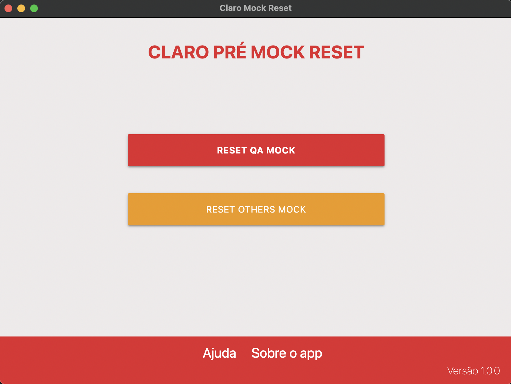

# Claro Mock Reset

Aplicativo desenvolvido para auxiliar os desenvolvedores e QAs resetarem
o mock do firebase de forma visual.



### Funcionalidades

- Reseta os números de telefone da faixa do QA
- Reseta os demais números de telefone


## Rodando o arquivo em modo de desenvolvimento

Crie um arquivo ```.env``` na raíz do projeto com a 
variável MOCK_URL, que deverá ter o caminho que aponta
para a url do firebase.
Na raíz do projeto consta um exemplo do arquivo ````.env````


### Build

Os builds por enquanto devem ser realizado em seus respectivos
sistemas operacionais. Exemplo:

- Se o desejo é de criar um executável para o Ubuntu, o build deverá ser feito a partir deste sistema


### Contribua

- Para contribuir com este projeto é necessário somente abrir um 
Pull Request para issues já existentes, lembre-se de criar o PR
seguindo o modelo do PR existente.
- Caso o issue que deseja contribuir não exista, crie e aguarde
o retorno do mantainer do projeto para verificar se não existe
uma release com este issue resolvido.
- Padrão do nome do branch da issue:
```issue-4/build-squirrel```
tipo de problema-numero da issue/titulo

### Scripts

Start do projeto use `npm start`

Build do app `npm run make`


### Documentos externos

- Documentação electronjs:

    https://www.electronjs.org/

- Ferramenta de build do app:

    https://www.electronforge.io/

- Ferramenta de live reload(desenvolvimento):

  https://github.com/sindresorhus/electron-reloader
